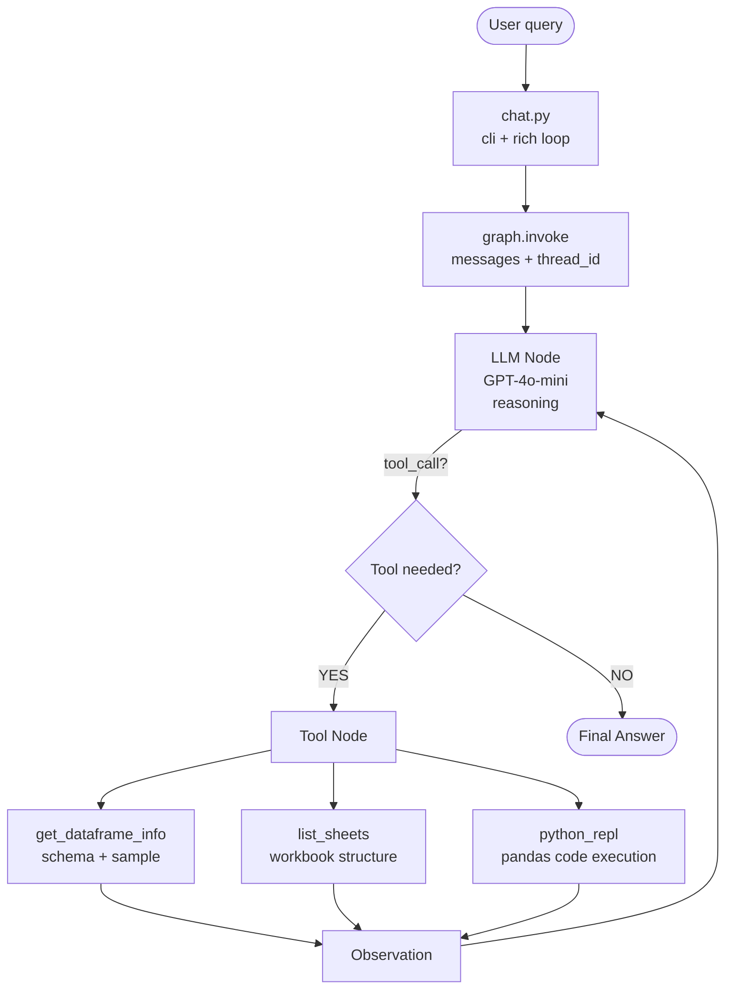

# Excel Analyst Agent — LangGraph ReAct

A terminal-based AI agent that lets you analyze any Excel file using natural language.
Built with **LangGraph**, **LangChain**, and the **OpenAI API** as a training project for senior Python developers.

---

## Architecture

### Why LangGraph ReAct?

| Approach | Status | Reason |
|---|---|---|
| `create_react_agent` (LangGraph) | ✅ Recommended 2025 | Stable API, explicit graph, native memory |
| `create_pandas_dataframe_agent` (langchain_experimental) | ⚠️ Legacy | Less transparent, harder to extend |
| Plain LangChain chains | ❌ Too limited | No loop, no tool orchestration |

**ReAct = Reasoning + Acting**: the LLM reasons about the question, decides which tool to use, observes the result, then reasons again — iterating until it produces a final answer.

### Agent Flow



### File Structure

```
.
├── chat.py          # Entry point: CLI arg + Rich chat loop
├── agent.py         # LangGraph ReAct graph definition
├── tools.py         # Custom tools (get_info, list_sheets, python_repl)
├── state.py         # Typed agent state (TypedDict)
├── requirements.txt
├── .env.example
├── README.md        # This file
├── GUIDE.md         # Trainer script (Spanish)
├── data/
│   └── sample.xlsx  # Sample sales workbook (3 sheets, ~200 rows)
└── exercises/
    ├── exercise_1.md
    ├── exercise_2.md
    ├── exercise_3.md
    └── solutions/
        ├── solution_1.md
        ├── solution_2.py
        └── solution_3.py
```

---

## Installation

### Prerequisites
- Python 3.11+
- An OpenAI API key

### Steps

```bash
# 1. Clone / download the project
cd Excel

# 2. Create and activate a virtual environment
python -m venv .venv
source .venv/bin/activate        # Linux/macOS
# .venv\Scripts\activate         # Windows

# 3. Install dependencies
pip install -r requirements.txt

# 4. Configure environment variables
cp .env.example .env
# Edit .env and add your OPENAI_API_KEY

# 5. Generate sample data (optional)
python generate_sample.py

# 6. Run the agent
python chat.py data/sample.xlsx
```

---

## Environment Variables

| Variable | Required | Default | Description |
|---|---|---|---|
| `OPENAI_API_KEY` | ✅ | — | Your OpenAI API key |
| `OPENAI_MODEL` | ❌ | `gpt-4o-mini` | Model to use |

---

## Usage

```bash
# Pass the file as a CLI argument
python chat.py data/sample.xlsx

# Or run without arguments — the agent will prompt for the path
python chat.py
```

### Example Questions

```
You: What columns does this file have?
You: How many rows are there?
You: What is the total sales by region?
You: Show me the top 5 customers by revenue
You: What was the best month for sales?
You: Are there any missing values?
You: What is the average order value per product category?
You: Show me a summary of the Clients sheet
```

### Multi-turn Memory

The agent remembers previous turns automatically (via `MemorySaver` + fixed `thread_id`):

```
You: What are the top 3 products by sales?
Agent: The top 3 products are: 1. Widget A ($45,200), 2. …

You: Can you show me only those products filtered to Q4?
Agent: Sure, filtering the top 3 from my previous answer to Q4…
```

---

## Available Tools

| Tool | When used | What it does |
|---|---|---|
| `get_dataframe_info` | First query about data | Returns schema, dtypes, describe(), head(5) |
| `list_sheets` | Questions about workbook structure | Lists all sheets with row counts |
| `python_repl` | Any computation / analysis | Runs pandas code; has `df`, `all_sheets`, `pd` |

---

## Key Design Decisions

### `PythonAstREPLTool` over `exec()`
The REPL parses code through Python's AST before executing it, which prevents a class of injection attacks. It also provides cleaner error messages.

### `MemorySaver` for multi-turn history
LangGraph checkpoints the full graph state after each turn. Using a fixed `thread_id` per session means references like "the result from before" or "those 5 products" work naturally.

### `temperature=0`
Data analysis requires determinism. We want consistent, reproducible answers, not creative variation.

### Read-only DataFrame
The system prompt and tool description both instruct the LLM never to modify `df` in place. This protects against accidental mutations across turns.

---

## Extending the Agent

To add a new tool:

```python
# In tools.py, inside build_tools():

@tool
def my_new_tool(param: str) -> str:
    """
    Describe what this tool does in plain English.
    The LLM reads this docstring to decide when to call the tool.
    """
    # ... implementation
    return result

# Then add it to the return list:
return [get_dataframe_info, list_sheets, repl, my_new_tool]
```

---

## License

MIT — free to use and adapt for training purposes.
